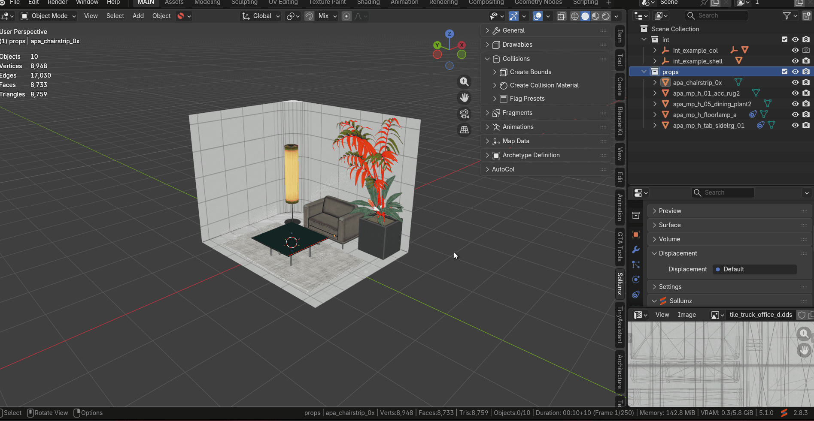
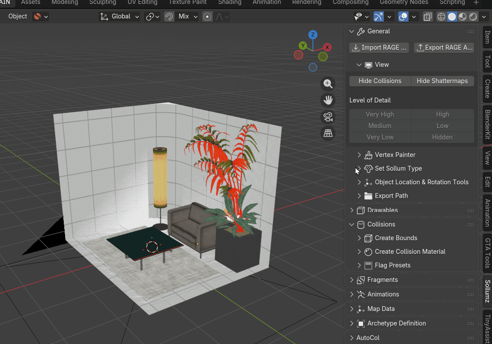
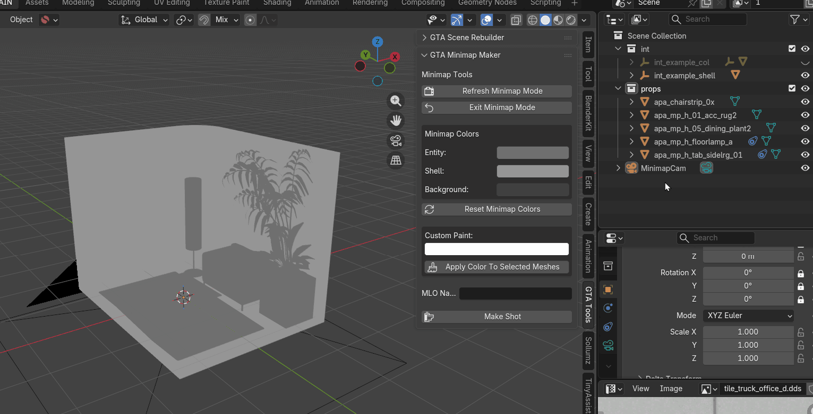
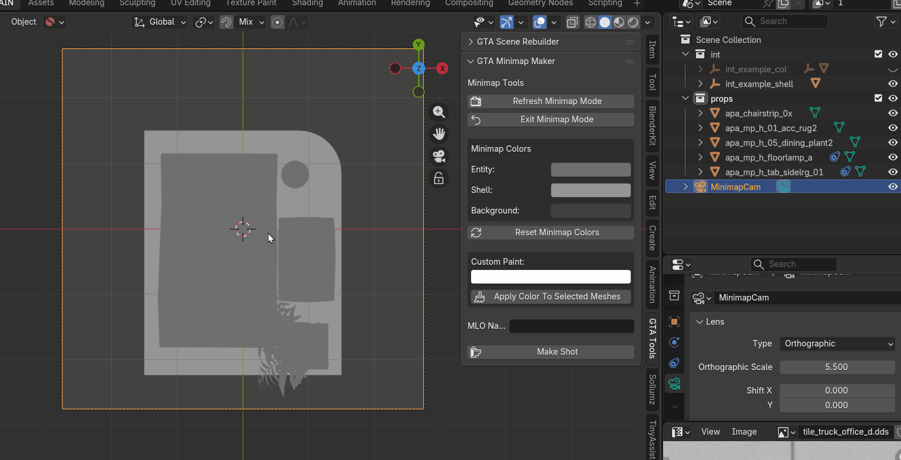
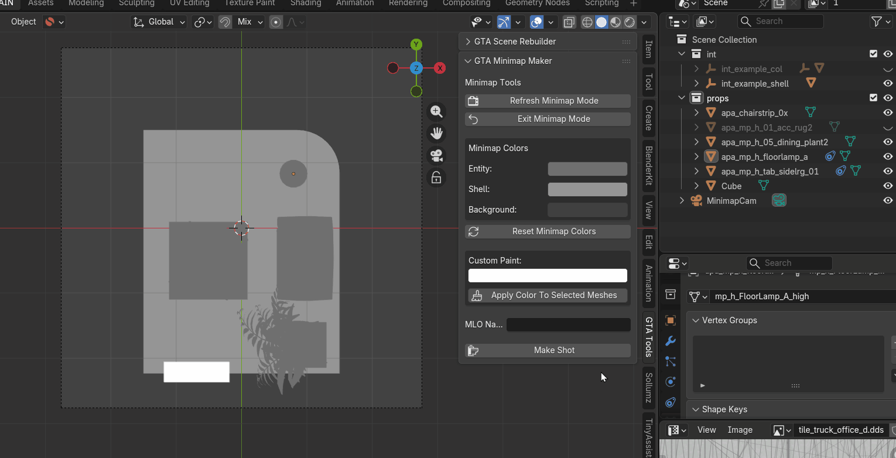
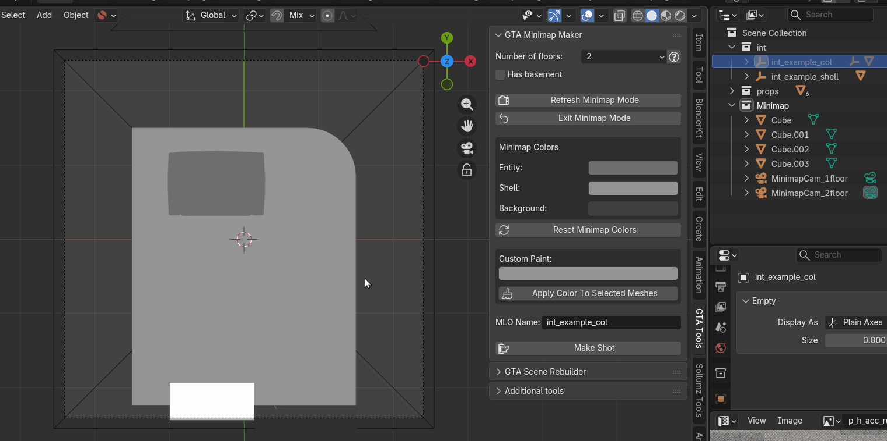
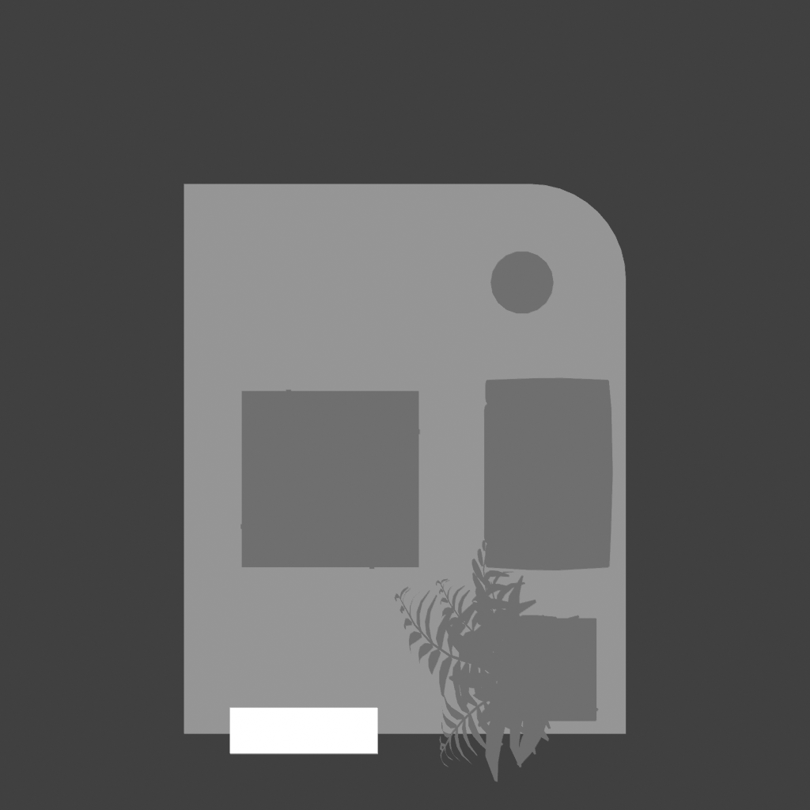
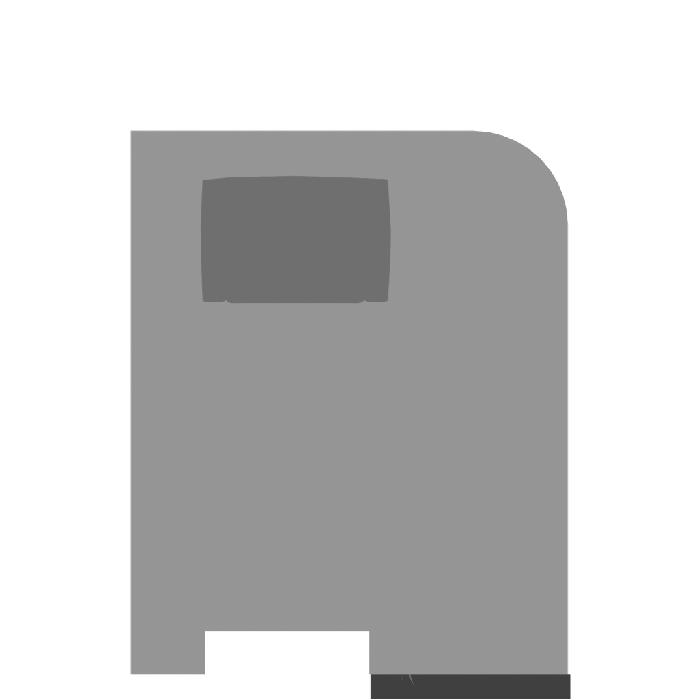

# GTA Minimap Maker

Blender addon for generating GTA V MLO minimaps directly from Sollumz scenes.

The addon automatically renders an orthographic top view, converts it into vector graphics using Potrace, imports the vector into a GFX template using JPEXS Free Flash Decompiler and exports a ready-to-use minimap for GTA V.

---

## Features

- One-click minimap generation
- Automatic orthographic rendering
- Layered rendering (Background, Shell, Entity, Walls, Custom)
- Automatic SVG generation using Potrace
- Automatic GFX generation using JPEXS
- Automatic JOAAT hash generation
- Custom object painting (only one custom color)
- Ready-to-use GTA V minimap export

---

## Requirements

- Blender 5.1+ (earlier versions have not been tested)
- Sollumz 2.8.3+ (recommended)
- JPEXS Free Flash Decompiler

### JPEXS Free Flash Decompiler

https://github.com/jindrapetrik/jpexs-decompiler

### Potrace (included)

https://potrace.sourceforge.net/

### Works better with GTA Scene Rebuilder

https://github.com/Vakhrush/GTA-Scene-Rebuilder

---

## Installation

1. Download the latest release.
2. Open Blender.
3. **Edit → Preferences → Add-ons**
4. Click **Install...**
5. Select the ZIP archive.
6. Enable **GTA Minimap Maker**.

---

## Addon Settings

Open:

**Edit → Preferences → Add-ons → GTA Minimap Maker**

Configure the following options:

### Output Path

Directory where generated minimaps will be saved.

### JPEXS Folder

Folder containing **ffdec-cli.exe**.

Example:

```text
C:\Program Files (x86)\FFDec\
```

### Shot Resolution

Higher values produce more detailed minimaps but increase export time.

Recommended values:

- 1024
- 2048



---

## Workflow

### 1. Refresh Minimap Mode

Select:

- **Number of floors** (1–4)
- **Has Basement** (optional)

Click:

**Refresh Minimap Mode**

Switch the viewport to **Solid** shading.

The addon automatically:

- creates a **Minimap** collection;
- creates one camera for each floor;
- optionally creates a basement camera.




---

### 2. Configure Camera

For each generated camera, adjust only:

**Object → Transform**

- Location Z

and

**Camera Data**

- Orthographic Scale
- For multi-floor MLOs, configure the camera's **Clip Start and Clip End** values to exclude lower floors from the export.

Do not modify:

- Camera Rotation (XYZ)
- Camera Location X/Y
- Camera Shift



---

### 3. Prepare the Scene

Configure the minimap appearance.

Examples:

- Hide unnecessary props.
- Paint objects using **Custom Paint**.
- Create white helper meshes representing entrances, exits or other map icons (single custom color).
- Prepare the scene exactly as you want it to appear on the minimap.



---

### 4. Enter MLO Name

Enter the MLO name in the addon panel.

The addon automatically calculates the JOAAT hash and names the exported GFX accordingly.



---

### 5. Export

Click:

**Make Shot**

For each floor, the addon automatically:

- renders the scene;
- generates vector layers;
- merges SVG layers;
- creates the floor SVG;
- builds the final GFX;
- patches the MLO name;
- patches the JOAAT hash;
- imports all generated SVGs into the GFX;
- exports the finished minimap.



---

## Output

The output directory contains:

- `int<hash>.gfx`
- floor SVG files (`3.svg`, `5.svg`, `7.svg`, `9.svg`)
- optional `1.svg` (basement)
- PNG preview for each exported floor

Temporary files are automatically removed.





---

## Current Limitations

- Supports up to **4 floors** plus **1 optional basement**.
- Camera Shift is not supported.
- Camera Rotation and Location X/Y must remain unchanged.

---

## Roadmap

- Additional customization options
- Additional export options

---

## Support

If GTA Minimap Maker has been useful for your projects and saved you time, you can support its future development.

➡️ See DONATE.md